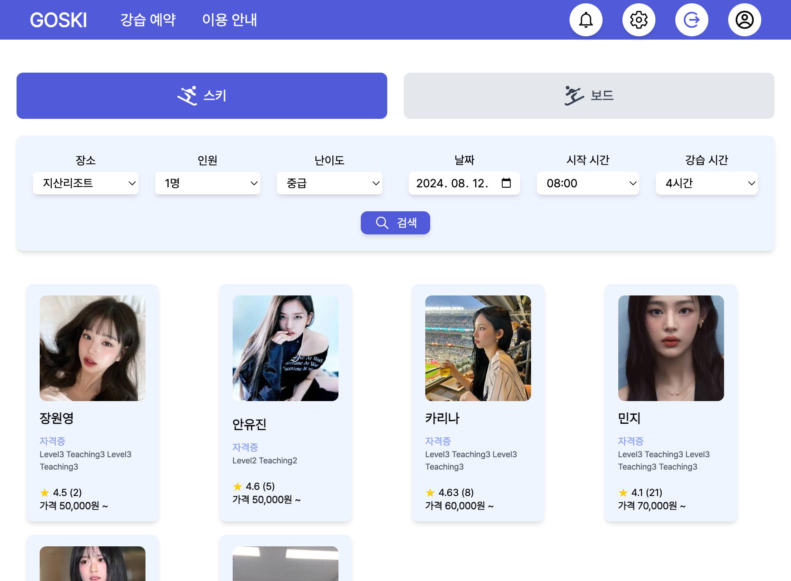
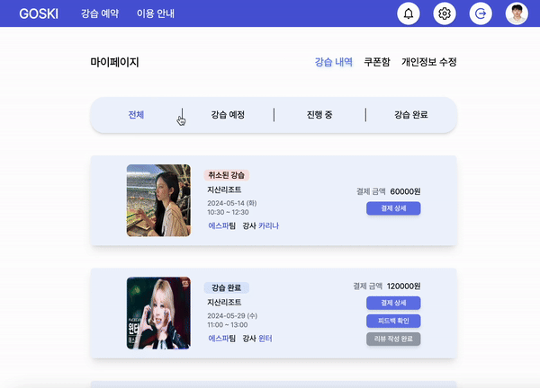
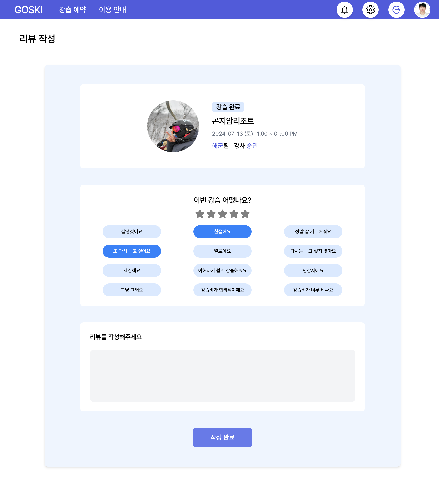

    
    <h1 style="margin-left: 20px;">스키 강습 플랫폼 GOSKI</h1>

&nbsp;

## 목차

1. [**서비스 소개**](#1)
2. [**주요기능 소개**](#2)
3. [**기술 스택**](#3)
4. [**시스템 아키텍처**](#4)
5. [**팀원 소개**](#5)
6. [**프로젝트 일정**](#6)
7. [**참고**](#7)

&nbsp;

## 😎 서비스 체험하기
### 서비스 링크(http://52.79.150.251)

&nbsp;

## 💡 서비스 소개

### 검증된 개인 맞춤형 스키/보드 강습
스키장에 처음왔는데 어떤 강습을 받아야할지 모른다면?  
GOSKI에서 검증받은 강사 분들께 맞춤 강습을 받을 수 있습니다!  
강습 이후에는 강사 분들로부터 받은 피드백을 통해 실력을 향상 시킬 수 있어요.

### 효율적인 강습 팀과 강습 스케줄 관리
GOSKI와 함께라면팀 단위 및 개인 단위 스케줄을 최적으로 분배할 수 있습니다.  
보다 쉽고 간편하게 강습 스케줄을 관리해보세요! 

&nbsp;

## 🖥️ 주요 기능 소개

### 수강생

#### 1. 로그인

#### 2. 강습 예약

|  |  |  |
| :------------------------------------: | :----------------------------------------: | :-------------------------------------------: |
|               필터 설정                |                필터 설정 결과 - 초급                 |             필터 설정 결과 - 중급, 고급    |       

|  | |   |  |
| :------------------------------------: | :----------------------------------------: | :------------------------------------: | :----------------------------------------: | 
|               초급(팀) 상세 페이지                |                중,고급(강사) 상세 페이지                 |                지정 강사 선택                |                결제                 |  

#### 3. 마이페이지 
|  |  |  |
| :------------------------------------: | :----------------------------------------: | :-------------------------------------------: |
|                강습/결제 내역                 |                피드백 조회                 |                   리뷰 작성                   |

&nbsp;
&nbsp;
### 강사

#### 1. 로그인 화면

#### 2. 메인 페이지
|  |  |  |
| :------------------------------------: | :----------------------------------------: | :-------------------------------------------: |
|                일정 확인                 |                팀 일정 등록                 |                   일정 상세                   |

#### 알림 

#### 강습 내역 / 팀원 관리
|  |  |  |
| :------------------------------------: | :----------------------------------------: | :-------------------------------------------: |
|                강습 내역                 |                팀원 관리                |                   강습비 설정                   |

#### 피드백 / 리뷰 내역
|  |  |  |
| :------------------------------------: | :----------------------------------------: | :-------------------------------------------: |
|                피드백 등록                 |                피드백 수정                 |                   리뷰 조회                   |

&nbsp;

## 🛠️ 기술 스택

###  Frontend

   
  
  
  

### Backend

   
   
   
 
   

### Database

  

### DevOps

  

  
     

### 공통
   

<h4>

<b> 상세 기술스택 및 버전 </b> 

| 구분       | 기술스택            | 상세내용               | 버전      |
|----------|-----------------|--------------------|---------|
| 공통       | 형상관리            | GitHub             | \-      |
|          | 이슈관리            | Jira               | \-      |
|          | 커뮤니케이션          |  Notion | \-      |
| BackEnd  | DB              | MariaDB            | 11.3.2  |
|          |                 | JPA                | \-      |
|          |                 | Redis              | 7.2.4   |
|          | Java            | JDK-17             | 17.0.10 |
|          | Spring          | Spring             |         |
|          |                 | Spring Boot        | 3.2.4   |
|          |                 | Spring Security    | \-      |
|          | IDE             | IntelliJ           |         |
|          | Cloud Storage   | AWS S3             | \-      |
|          | Build           | Gradle             | 8.7     |
| FrontEnd | React        |                    | \-      |
|          | TypeScript            |                    | \-      |
|          | TailwindCSS           |                    | \-      |
|          | Vite        |                    |         |
| Server   | 서버            | AWS EC2             | \-      |
|          | 플랫폼            | Ubuntu             |         |
|          | 배포              | Docker             |         |
|          | 배포              | Jenkins            |         |

&nbsp;

## 🗂️ 시스템 아키텍처

&nbsp;

## 👪 팀원 소개

<table>
    <tr>
        <td height="140px" align="center">
               고승민  (Team Leader) </a>  </td>
        <td height="140px" align="center"> 
               임종율  (Back-End) </a>  </td>
        <td height="140px" align="center"> 
               장승호  (Front-End) </a>  </td>
  <td height="140px" align="center"> 
               김태훈  (Front-End) </a>  </td>
  <td height="140px" align="center"> 
               김현지  (Front-End) </a>  </td>
    </tr>
    <tr>
        <td align="center">
        <td align="center">
        <td align="center" style="width: 16.66%; word-wrap: break-word;">팀 관리 화면 제작 피드백/리뷰 화면 제작
        <td align="center">
        <td align="center" style="width: 16.66%; word-wrap: break-word;">유저 강습 예약 화면 제작 유저 결제 화면 제작 유저 마이페이지 화면 제작 강사 메인페이지(일정관리)제작
</table>

&nbsp;

## 📆 프로젝트 일정

### 2024.05.27 ~ 2024.07.26

- 기획 및 설계 : 2024.05.27 - 2024.06.07
- 프로젝트 구현 : 2024.06.10 - 2024.08.09
- QA 및 산출물 정리 : 2024.08.12 - 2024.08.14

&nbsp;

## 참고
